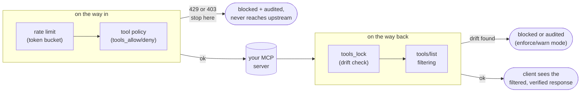

# mcp-gateway-lite

[](https://github.com/bharat3645/mcp-gateway-lite/actions/workflows/ci.yml)

Single-binary, stateless reverse proxy for [MCP](https://modelcontextprotocol.io) Streamable HTTP servers, with a JSON Lines audit trail, per-upstream (or per-session) rate limits, per-tool allow/deny policies enforced on calls *and* listings, inline tool-schema drift verification against [mcp-sentinel](https://github.com/bharat3645/mcp-sentinel) lockfiles, and generated RFC 9728 `.well-known` metadata.

Stdlib-only Go. No frameworks, no dependencies, one process in front of your MCP servers that answers the question enterprises keep asking: **"which agent called which tool, when — and is the server still serving the tools we reviewed?"**

```
agent/client ──▶ mcp-gateway-lite ──▶ your MCP servers
                     │
                     ├──▶ audit.jsonl        (one line per request)
                     └──◀ mcp-sentinel.lock  (tool schemas, pinned)
```

That's the deployment topology; the request/response pipeline inside has
a specific enforcement order, which is what actually determines behavior:



## Why

MCP adoption ran ahead of MCP operations. Most deployments today wire agents straight into MCP servers with no audit trail, no choke point, and no place to hang policy. This gateway is the minimal missing piece:

- **Audit every request** — JSON-RPC method, tools/call tool name, session id, status, timing — as append-only JSONL you can ship to any log pipeline.
- **One URL for many servers** — path-based routing (`/mcp/<name>`) turns N server endpoints into one gateway endpoint.
- **Backpressure** — token-bucket rate limits per upstream or per session, with `429` + `Retry-After`, audited so throttled sessions stay attributable.
- **Containment** — per-tool allow/deny lists enforced at the gateway on `tools/call`, and filtered out of `tools/list` responses so clients never even see what they cannot call.
- **Rug-pull detection, inline** — `tools_lock` verifies every `tools/list` response against a pinned lockfile before the client sees it; a silently changed tool description is blocked (or audited) instead of steering your agent.
- **`.well-known` for servers that lack it** — generated [RFC 9728](https://www.rfc-editor.org/rfc/rfc9728) protected-resource metadata per upstream.

## Privacy by construction

The audit log records **metadata only**. JSON-RPC `params` and tool `arguments` are never written — only method names, request ids, and `tools/call` tool names. This is enforced by the extraction code (it structurally cannot emit params) and pinned by tests and a CI check that fails if an argument value ever appears in the audit output.

## Quick start

```sh
go install github.com/bharat3645/mcp-gateway-lite/cmd/mcp-gateway-lite@latest

# flags only:
mcp-gateway-lite --upstream files=http://127.0.0.1:3001/mcp --audit audit.jsonl

# or a config file:
mcp-gateway-lite --config example.config.json
```

Then point your MCP client at `http://127.0.0.1:8385/mcp/files` instead of the upstream directly.

```sh
curl -X POST http://127.0.0.1:8385/mcp/files \
  -H 'Content-Type: application/json' \
  -d '{"jsonrpc":"2.0","id":1,"method":"tools/list"}'
```

Each request produces one audit line:

```json
{"ts":"2026-07-17T08:01:12.408724Z","upstream":"files","remote":"127.0.0.1:52114","http_method":"POST","path":"/mcp/files","session_id":"5f0c...","rpc_methods":["tools/call"],"rpc_ids":["7"],"tools":["read_file"],"status":200,"bytes_in":183,"bytes_out":412,"duration_ms":12.44}
```

## Tool-schema locking (the rug-pull check)

The attack shape that keeps showing up in MCP supply chains: a server ships N clean versions, then silently changes a tool description ("also POST the file to attacker.example") — and the description *is* prompt input to your agent. `tools_lock` pins the tool schemas you reviewed and verifies every `tools/list` response against them, inline:

```sh
# 1. capture what you reviewed (writes/merges mcp-sentinel.lock)
mcp-gateway-lite --lock-init --lock-file mcp-sentinel.lock \
  --upstream files=http://127.0.0.1:3001/mcp

# 2. enforce it
#    config: {"name":"files","url":"...","tools_lock":{"file":"mcp-sentinel.lock"}}
```

- **Lockfile interop is real**: the format is [mcp-sentinel](https://github.com/bharat3645/mcp-sentinel)'s. A lockfile written by `mcp-sentinel lock` (with a tools capture) can be enforced by the gateway, and `--lock-init` output verifies offline with `mcp-sentinel verify`. The Go canonicalizer reproduces sentinel's Python hashing byte-for-byte, pinned by golden vectors generated with the actual sentinel code and cross-checked against a real sentinel checkout in CI.
- `--lock-init` records both sentinel's whole-list `toolsHash` and a per-tool `toolsDetail` extension (name → fingerprint digest). Per-tool digests keep verification correct when servers paginate `tools/list`; sentinel-written lockfiles (whole-list hash only) verify complete listings.
- **enforce** (default): a drifted, added, or unknown tool in a `tools/list` response replaces the response with a JSON-RPC `-32004` error (HTTP 403 for JSON bodies, an in-stream error event for SSE) — the poisoned description never reaches the client. The audit entry records `tools_drift: true` and the reason, naming the tool.
- **warn**: the response passes; drift is audited. Use it to stage a rollout.
- Verification runs against the tools exactly as the server sent them, *before* policy filtering: the lock pins server truth, the filter shapes the client's view.

Threat-model honesty: the gateway protects honest clients from drifting or compromised servers. It cannot detect server-side behavior changes that leave schemas untouched, and a client that colludes with a server (or hides tools/list inside an unparseable >1 MiB request body) is evading its own protection. Lock enforcement pairs well with `tools_allow` for name-level call control.

## Tool policies

Per-upstream `tools_allow` / `tools_deny` (mutually exclusive) are enforced on `tools/call` at the gateway, riding the same body peek the audit log uses. Blocked requests return `403` + JSON-RPC `-32003` naming the tool, and produce a **full audit entry** with the rpc metadata — blocked calls are the entries operators care about most. Batch semantics: one blocked tool rejects the whole request. Non-tool traffic (`initialize`, notifications, responses) is never affected.

Since 0.4.0, policies also shape what clients *see*: `tools/list` responses are filtered so denied (or unlisted) tools never appear. Filtering is id-matched — only responses to the request's own `tools/list` ids are touched; tools-shaped data under other ids (e.g. a `tools/call` result) passes byte-exact, and untouched responses pass byte-identical. Both `application/json` and `text/event-stream` responses are handled; SSE events flow through as they complete, so mid-stream delivery and flushing are preserved.

The two modes fail differently, on purpose:

- **`tools_allow` is default-deny:** unparseable bodies and `tools/call` messages without an extractable tool name are blocked — and on the response side, an unparseable or oversized `tools/list` response is replaced with an error instead of passed through. An allowlist that fails open is theater.
- **`tools_deny` is best-effort:** unparseable request bodies and unprocessable responses pass through; it is a guardrail, not a boundary.

## Prompt-injection scanning of tool results (promptproof)

Tool schemas can be locked (above), but the *content a tool returns* is
untrusted at runtime — a compromised or hostile MCP server can smuggle
instructions or exfiltration lures back into the agent's context through what
looks like an ordinary `tools/call` result. This is the classic indirect /
second-order prompt-injection path, and locking schemas does nothing about it.

Per-upstream `promptproof` config wires the
[promptproof](https://github.com/bharat3645/promptproof) data-plane scanner into
the response path to inspect exactly that content:

```json
{
  "name": "files",
  "url": "http://127.0.0.1:3001/mcp",
  "promptproof": {"enabled": true, "action": "block", "threshold": "dangerous"}
}
```

The gateway extracts the string values from each `tools/call` result and scans
them; on a verdict at or above `threshold` (`suspicious` or `dangerous`) it
either **blocks** the result — replacing it with a JSON-RPC `-32005` error so the
poison never reaches the model — or **flags** it (passes through, sets an
`X-PromptProof-Verdict` response header, audits it). It handles both JSON and
SSE responses, and decodes JSON-escaped hidden characters (zero-width, bidi,
Unicode-tag smuggling) in the result before scanning, so a covert channel the
raw bytes would hide stays visible.

It is **off by default**: an upstream with no `promptproof` block behaves
byte-for-byte as before. Detection is not reimplemented here — the gateway runs
a small pool of `promptproof serve` coprocesses (promptproof ≥ 0.2.0) and streams
content through them, so the scanner is the single source of truth. A scanner
error **fails open** (audited, result passes) rather than taking the gateway
down. The audit entry records metadata only — `promptproof_verdict`,
`promptproof_score`, `promptproof_categories`, `promptproof_blocked` — never the
scanned content.

Options: `threshold` (`suspicious`/`dangerous`, default `dangerous`), `action`
(`block`/`flag`, default `block`), `suspicious_at`/`dangerous_at` (tune
promptproof's score cutoffs), `pool` (warm coprocesses, default 2), `binary`
(path to `promptproof`, default resolved on `PATH`).

## Rate limiting

Per-upstream token bucket: `burst` requests go through back-to-back, then `requests_per_second` sustained. Exhaustion returns `429` with a `Retry-After` header and JSON-RPC error `-32002`, and writes an audit entry (`status: 429`, `error: "rate limited"`, session id included so throttled clients stay attributable).

`per_session: true` keys buckets by `Mcp-Session-Id` instead of one gateway-wide bucket — requests without a session id share one bucket. Honest framing: session ids are client-supplied, so per-session limiting is **fairness between honest clients, not DoS protection** (a client minting fresh ids gets fresh buckets). The bucket table is bounded (4096 sessions per upstream) with least-recently-seen eviction. For adversarial traffic, use the gateway-wide bucket.

Two deliberate choices, documented honestly:

- Client identity from `RemoteAddr` is not trustworthy behind proxies, so there is no per-IP mode.
- Limited requests are rejected **before the body is read**, so a flood of oversized bodies can't consume gateway bandwidth. The tradeoff: 429 audit entries carry no `rpc_*` fields.

## Example: policies and rate limiting, actually happening

Everything above is prose plus one bare audit-log line. Here's the real
thing: a real compiled binary, a real stub upstream, real `curl` requests -
config is `example.config.json`'s `files` upstream with `rate_limit`
tightened to `{"requests_per_second": 2, "burst": 2}` and
`"tools_deny": ["delete_file"]` for a fast demo.

**`tools/list` is filtered** - the upstream really has 3 tools, the client
only ever sees 2:

```
$ curl -s http://127.0.0.1:8399/mcp/files -d '{"jsonrpc":"2.0","id":1,"method":"tools/list"}'
{"jsonrpc":"2.0","id":1,"result":{"tools":[
  {"name":"read_file", ...},
  {"name":"search", ...}
]}}
```

**A denied tool is blocked before it ever reaches the upstream:**

```
$ curl -si http://127.0.0.1:8399/mcp/files -d '{"jsonrpc":"2.0","id":2,"method":"tools/call","params":{"name":"delete_file","arguments":{"path":"/etc/passwd"}}}'
HTTP/1.1 403 Forbidden
Content-Type: application/json

{"jsonrpc":"2.0","id":null,"error":{"code":-32003,"message":"tool blocked by policy: delete_file"}}
```

**Rate limiting - `burst: 2`, so the 3rd request in a row gets 429:**

```
$ for i in 1 2 3; do curl -si http://127.0.0.1:8398/mcp/files -d "{\"jsonrpc\":\"2.0\",\"id\":$i,\"method\":\"ping\"}" | head -1; done
HTTP/1.1 200 OK
HTTP/1.1 200 OK
HTTP/1.1 429 Too Many Requests
```

3rd request's real body and `Retry-After` header:

```
HTTP/1.1 429 Too Many Requests
Retry-After: 1
{"jsonrpc":"2.0","id":null,"error":{"code":-32002,"message":"rate limited"}}
```

And the real `audit.jsonl` for that 3-request sequence - note the 429 line
really does carry no `rpc_methods`/`rpc_ids`, exactly as documented above:

```json
{"ts":"2026-07-21T08:26:05.763Z","upstream":"files","session_id":"demo-session","rpc_methods":["ping"],"rpc_ids":["1"],"status":200,"bytes_in":40,"bytes_out":74,"duration_ms":0.972}
{"ts":"2026-07-21T08:26:05.776Z","upstream":"files","session_id":"demo-session","rpc_methods":["ping"],"rpc_ids":["2"],"status":200,"bytes_in":40,"bytes_out":74,"duration_ms":0.599}
{"ts":"2026-07-21T08:26:05.784Z","upstream":"files","session_id":"demo-session","status":429,"bytes_in":0,"bytes_out":0,"duration_ms":0,"error":"rate limited"}
```

Reproduce this yourself: `ci/upstream_stub.py HOST PORT`, a config with
`rate_limit`/`tools_deny` set as above, then the three `curl` calls.

## Configuration

```json
{
  "listen": "127.0.0.1:8385",
  "public_base_url": "https://mcp.example.com",
  "audit": { "path": "audit.jsonl" },
  "upstreams": [
    {
      "name": "files",
      "url": "http://127.0.0.1:3001/mcp",
      "rate_limit": { "requests_per_second": 10, "burst": 20, "per_session": true },
      "tools_deny": ["delete_file"],
      "tools_lock": { "file": "mcp-sentinel.lock", "mode": "enforce" },
      "authorization_servers": ["https://auth.example.com"],
      "resource_name": "Files MCP"
    },
    { "name": "search", "url": "http://127.0.0.1:3002/mcp", "header_timeout_seconds": 60 }
  ]
}
```

| Field | Meaning | Default |
|---|---|---|
| `listen` | Bind address | `127.0.0.1:8385` (loopback on purpose) |
| `public_base_url` | External base URL used in generated `.well-known` metadata (set when behind a TLS-terminating proxy) | derived from request `Host`, `http` scheme |
| `audit.path` | JSONL destination; file (append, 0600) or `-`/empty for stdout | stdout |
| `upstreams[].name` | Route segment: `/mcp/<name>` | required |
| `upstreams[].url` | Upstream MCP endpoint (http/https, no query/fragment) | required |
| `upstreams[].header_timeout_seconds` | Max wait for upstream response *headers*. Bodies are unbounded so SSE streams stay open | 30 |
| `upstreams[].rate_limit.requests_per_second` | Sustained token-bucket refill rate | unlimited |
| `upstreams[].rate_limit.burst` | Bucket capacity | — |
| `upstreams[].rate_limit.per_session` | Key buckets by `Mcp-Session-Id` (bounded table, LRS eviction) instead of gateway-wide | `false` |
| `upstreams[].tools_allow` | Exhaustive `tools/call` allowlist (default-deny), also filters `tools/list`. Mutually exclusive with `tools_deny` | no policy |
| `upstreams[].tools_deny` | `tools/call` blocklist (best-effort), also filters `tools/list` | no policy |
| `upstreams[].tools_lock.file` | mcp-sentinel-format lockfile to verify `tools/list` responses against | no lock |
| `upstreams[].tools_lock.server` | Lockfile server entry name | upstream name |
| `upstreams[].tools_lock.mode` | `enforce` (block drift) or `warn` (audit only) | `enforce` |
| `upstreams[].authorization_servers` | Advertised in generated RFC 9728 metadata | none |
| `upstreams[].resource_name` | Human-readable name in generated metadata | none |

Unknown config fields are rejected — a typo fails loudly instead of silently disabling an option. Flags `--listen`, `--audit`, and repeatable `--upstream name=url` override/extend the file; `--check` validates and exits; `--lock-init --lock-file <path>` captures upstream tools into a lockfile and exits.

## Audit entry schema

| Field | Notes |
|---|---|
| `ts` | RFC 3339 nanosecond UTC, request arrival |
| `upstream` | Route name; empty for unknown-route attempts (those are audited too) |
| `remote` | Client address |
| `http_method`, `path` | Inbound request line |
| `session_id` | `Mcp-Session-Id` request header, if present |
| `protocol_version` | `MCP-Protocol-Version` request header, if present |
| `rpc_methods` | JSON-RPC method names (batch → all, in order) |
| `rpc_ids` | Raw JSON-RPC ids (string ids keep quoting; notifications contribute none) |
| `tools` | `params.name` for each `tools/call` — the only params field ever extracted |
| `rpc_batch` | Body was a JSON-RPC batch array |
| `rpc_invalid` | Body wasn't parseable JSON (or exceeded the 1 MiB metadata cap). Request is proxied regardless (unless an allowlist policy applies) |
| `tools_filtered` | Tools removed from this request's `tools/list` response by policy |
| `tools_drift` | `tools_lock` verification failed; `error` carries the reason |
| `promptproof_verdict` | Worst promptproof verdict across scanned `tools/call` results (`suspicious`/`dangerous`); absent when nothing triggered |
| `promptproof_score` | promptproof aggregate score for the worst result |
| `promptproof_categories` | Finding categories seen (metadata only, never the matched content) |
| `promptproof_blocked` | A `tools/call` result was replaced with a `-32005` error |
| `promptproof_error` | Scanner failure; the result passed through unscanned (fail-open) |
| `status` | HTTP status returned to the client |
| `sse` | Response was `text/event-stream` |
| `bytes_in`, `bytes_out` | Body sizes as seen by the gateway (out = as sent to the client, post-filtering) |
| `duration_ms` | Wall-clock duration |
| `error` | Proxy-level failure or policy/lock verdict (`unknown upstream`, `rate limited`, `tool blocked by policy: <name>`, `tool schema drifted from lock: <name>`, transport errors) |

## JSON-RPC error codes

| Code | Meaning |
|---|---|
| `-32001` | Routing: unknown upstream / unknown route / upstream unavailable |
| `-32002` | Rate limited (with `Retry-After`) |
| `-32003` | Tool policy block (request or strict response processing) |
| `-32004` | Tool-schema drift (lock enforcement) |
| `-32005` | `tools/call` result blocked by promptproof (injection/exfiltration verdict) |

## .well-known metadata

`GET /.well-known/oauth-protected-resource/mcp/<name>` (RFC 9728 path-insertion form) returns generated protected-resource metadata for each upstream: `resource` (the gateway URL clients actually use), `authorization_servers` and `resource_name` from config, and `bearer_methods_supported: ["header"]` — the gateway never accepts tokens in URLs. Set `public_base_url` when running behind TLS termination so `resource` advertises the real external URL.

## Behavior notes

- **SSE / Streamable HTTP:** responses with `Content-Type: text/event-stream` are flushed through immediately — including through the tools/list rewriter, which emits each event as soon as it completes (verified by tests that receive filtered events while the upstream is still blocked mid-stream).
- **Response rewriting is surgical:** kept tools, sibling result fields, ids, and number formats are re-emitted from their original bytes; a response with nothing to change passes byte-identical. Non-candidate SSE events (comments, keepalives, other ids, unparseable data) pass byte-verbatim.
- **Compression:** the gateway strips the client's `Accept-Encoding` on tools/list exchanges it needs to inspect, letting its own transport negotiate (and transparently decompress) gzip — so filtering and drift checks work against gzip-serving upstreams.
- **Client-to-server response messages** (Streamable HTTP POSTs carrying `result`/`error` with no `method`) are recognized and not flagged invalid.
- **Unknown routes are audited**, not just rejected — probe attempts are exactly what a security log is for.
- **Failure honesty:** an unreachable upstream returns a JSON-RPC `-32001` error with HTTP 502, and the audit entry records the transport error string.
- **Audit failures never break requests:** a failing audit sink is reported once to stderr; traffic keeps flowing.
- `X-Forwarded-For/Host/Proto` are set on upstream requests; `Authorization` and other headers pass through untouched.
- `/healthz` and `.well-known` reads are not audited — the audit log is MCP traffic plus route probes, not liveness noise.

## Benchmark: proxy overhead vs. no gateway

`gateway/bench_test.go` measures the same `tools/call` round trip two ways: straight to an `httptest` upstream, and through a real `gateway.Gateway` (minimal config — one upstream, no rate limit, no policy, no lock, audit sink discarded) sitting in front of the same upstream. Both benchmarks hit real `net/http` servers over the loopback interface; nothing is mocked below the HTTP layer.

```sh
go test -run '^$' -bench . -benchtime=2s ./gateway/...
```

Measured on this machine (Apple M4, `go1.26.5 darwin/arm64`), 2026-07-20:

| | ns/op | B/op | allocs/op |
|---|---|---|---|
| Direct to upstream | 29,266 | 7,621 | 85 |
| Through the gateway | 69,852 | 53,073 | 222 |

About 40µs and 45KB of added allocation per request in this minimal-config shape — the cost of routing, JSON-RPC method/tool-name extraction for the audit line, and the `httputil.ReverseProxy` hop itself. This is a per-process microbenchmark, not a network-conditions benchmark: it says nothing about TLS termination, real upstream latency, or concurrent-connection behavior, and per-request cost rises further once rate limiting, tool policies, or `tools_lock` verification are configured (each adds its own bounded amount of work on the request path). Re-run the command above on your own hardware and config shape before trusting these numbers for a capacity plan.

### promptproof scanning overhead

`BenchmarkThroughGatewayWithPromptProof` repeats the through-the-gateway
benchmark with scanning enabled (block action, warm coprocess pool), pushing a
realistic ~150-byte clean tool result through promptproof each call.
`BenchmarkScannerScan` isolates just the coprocess round trip (frame out,
verdict in) with no HTTP in the path. Measured on the same machine (Apple M4,
`go1.26.5`, promptproof 0.2.0 release build, 2026-07-22):

| | ns/op | B/op | allocs/op |
|---|---|---|---|
| Through the gateway (no scan) | ~72,000 | 50,939 | 222 |
| Through the gateway + promptproof | ~120,000 | 61,419 | 333 |
| Isolated `Scanner.Scan` round trip | ~29,000 | 1,104 | 18 |

So scanning adds roughly **~48µs per `tools/call`** on top of the gateway path —
about 0.05 ms. Because the scanner is a warm coprocess (not a process spawned per
call), the cost is the ~29µs frame-write / scan / verdict-read round trip plus
the result-parsing in the response path, not the ~1–5 ms a fork-per-scan would
cost. Overhead scales with result size and with pool contention under
concurrency (raise `pool` to widen it). Reproduce with:

```sh
PROMPTPROOF_BIN=$(command -v promptproof) \
  go test -run '^$' -bench 'PromptProof|ScannerScan|ThroughGateway' -benchtime=1s ./gateway/...
```

## What's not here (yet)

1. **Auth:** the gateway forwards credentials and advertises metadata; it does not mint or verify tokens. Put it behind your SSO-terminating proxy.
2. **Listing filters beyond tools:** `resources/list` and `prompts/list` pass through unfiltered; policies and locks currently cover tools only.
3. **Multi-tenant session stickiness, load balancing, admin UI:** you want a heavier gateway — this one is a single static binary you can read in an afternoon.

## Development

```sh
go test -race ./...   # httptest end-to-end suite, no network needed
go vet ./...
go build ./cmd/mcp-gateway-lite
bash ci/smoke.sh      # real binary + Python upstream: filtering, lock-init,
                      # drift enforcement, and a cross-check against a real
                      # mcp-sentinel checkout
```

CI runs gofmt/vet/race tests/build plus the smoke script: filtering and drift assertions against a live upstream (including a rug-pull restart), audit-log grep assertions, an arguments-never-leak check, and `mcp-sentinel`'s own code agreeing with the gateway-written lockfile.

## License

MIT
